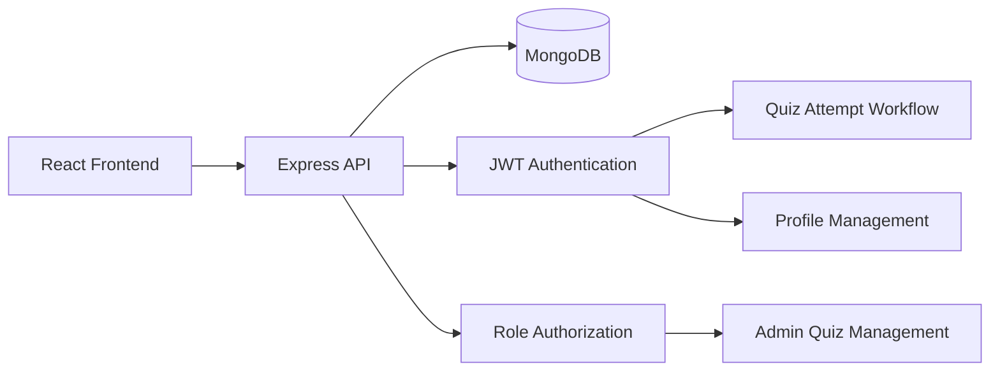

# BrainBuzz

BrainBuzz is a full-stack quiz management platform that allows users to register, manage profiles, attempt quizzes, and receive instant scores, while administrators can create and manage question sets for the community.

## Why I Built This

BrainBuzz was developed to explore full-stack application development, authentication workflows, role-based access control, and quiz management systems. The project focuses on providing secure user experiences while supporting administrative content management through dedicated workflows.

---

## Key Features

### User Features

* Secure user registration and login
* JWT-based authentication
* Profile creation and management
* Browse and attempt quizzes
* Instant quiz scoring and feedback
* Dashboard experience for authenticated users

### Admin Features

* Create and manage quiz question sets
* Role-based access control
* Manage quiz content for the platform
* Publish quizzes for users

---

## Tech Stack

### Frontend

* React 19
* TypeScript
* Vite
* React Router
* React Hook Form
* Axios

### Backend

* Node.js
* Express.js
* MongoDB
* Mongoose
* JWT Authentication
* bcrypt
* Multer

---

## Architecture Overview



## Project Structure

```text
BrainBuzz/
├── backend/
│   ├── controller/
│   ├── middleware/
│   ├── model/
│   └── routes/
│
└── frontend/
    ├── components/
    ├── pages/
    └── utils/
```

## Quick Start

### Clone Repository

```bash
git clone <repository-url>
cd BrainBuzz
```

### Backend Setup

```bash
cd backend
npm install
```

Create a `.env` file:

```env
MONGO_URI=mongodb://localhost:27017/professor_database
AUTH_SECRET_KEY=replace_with_a_strong_secret
PORT=3000
```

Run the backend:

```bash
npm start
```

### Frontend Setup

```bash
cd frontend
npm install
npm run dev
```

---

## API Highlights

### Authentication

* User Registration
* User Login
* JWT Verification

### Profile Management

* View Profile
* Update Profile

### Quiz Management

* List Quiz Sets
* Attempt Quiz
* Automatic Score Calculation

### Admin Operations

* Create Question Sets
* Manage Quiz Content

---

## Recruiter Highlights

This project demonstrates:

* Full-stack application development
* JWT authentication and authorization
* Role-based access control
* REST API development with Express.js
* MongoDB data modeling with Mongoose
* Secure route protection
* React frontend architecture
* End-to-end user and admin workflows

The project goes beyond basic CRUD functionality by implementing authentication, authorization, automated quiz scoring, and role-specific user experiences.

---

## Future Improvements

* Quiz history and analytics dashboard
* Refresh token authentication flow
* Automated testing
* Advanced reporting and insights
* Stronger validation and rate limiting

---

## License

This project is currently unlicensed.
