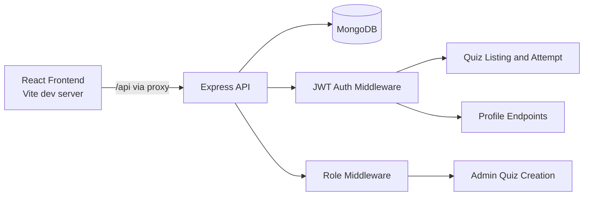

# BrainBuxx

BrainBuxx is a full-stack quiz platform where users can register, manage profiles, attempt quizzes, and view instant scores, while admins can create question sets for the community.

## What This Project Does

- Secure authentication with JWT
- Role-based authorization (`professional`, `admin`)
- Quiz creation workflow for admins
- Quiz attempt workflow with automatic scoring
- Profile view and edit for authenticated users
- Dashboard-style home experience for authenticated and guest users

## Tech Stack

### Frontend
- React 19 + TypeScript
- Vite
- React Router
- React Hook Form
- Axios

### Backend
- Node.js + Express
- MongoDB + Mongoose
- JWT + bcrypt
- Multer (file upload middleware)

## Architecture Overview



## Project Structure

```text
BrainBuzz/
  backend/
    app.js
    bin/www
    controller/
    middleware/
    model/
    routes/
  frontend/
    src/
      components/
      pages/
      utils/
    vite.config.ts
```

## Quick Start

### 1) Clone and install dependencies

```bash
git clone <your-repo-url>
cd BrainBuzz

cd backend
npm install

cd ../frontend
npm install
```

### 2) Configure environment variables (backend)

Create `backend/.env`:

```env
MONGO_URI=mongodb://localhost:27017/professor_database
AUTH_SECRET_KEY=replace_with_a_strong_secret
PORT=3000
```

### 3) Run the backend

```bash
cd backend
npm start
```

Backend runs on `http://localhost:3000` by default.

### 4) Run the frontend

```bash
cd frontend
npm run dev
```

Frontend runs on `http://localhost:5173` by default.

## Frontend Scripts

Inside `frontend/`:

- `npm run dev` - start Vite development server
- `npm run build` - type-check and create production build
- `npm run lint` - run ESLint checks
- `npm run preview` - preview production build

## Backend Scripts

Inside `backend/`:

- `npm start` - start API server with nodemon (`bin/www`)

## Authentication and Roles

- Register user: `POST /api/user/create`
- Register admin: `POST /api/user/create-admin`
- Login: `POST /api/user/login`
- Token verify: `GET /api/verify/me`

Use this header for protected endpoints:

```http
Authorization: Bearer <accessToken>
```

## API Summary

### Auth and User

- `GET /api/user/` - user route health message
- `POST /api/user/create` - create professional user
- `POST /api/user/create-admin` - create admin user
- `POST /api/user/login` - login and receive JWT
- `GET /api/user/list` - list users (auth required)
- `GET /api/user/profile/me` - fetch current profile (auth required)
- `GET /api/user/profile/:id` - fetch profile by user id (auth required)
- `PUT /api/user/profile` - update current profile (auth required)

### Quiz

- `GET /api/questions/set/list` - list quiz sets (auth required)
- `GET /api/questions/set/:id` - get one quiz set without answers (auth required)
- `POST /api/questions/answer/attempt` - submit and grade quiz attempt (auth required)

### Admin

- `POST /api/admin/questionset/create` - create question set (auth + admin role required)

## Core Data Models

- `User`: name, email, password (hashed), role
- `Profile`: user reference, bio, skills, profile links, profile image path
- `QuestionSet`: title, questions, choices, correct answer flags, createdBy
- `Answer`: user attempt, selected choices, score, total, submission time

## Typical User Flow

1. Register a new account or login.
2. Access quiz list from dashboard/navigation.
3. Attempt a quiz and submit answers.
4. Receive score immediately.
5. Update profile information from profile page.

## Typical Admin Flow

1. Create admin account (or login as admin).
2. Open create quiz page.
3. Add title, questions, choices, and correct answers.
4. Publish question set for authenticated users.

## Notes for Development

- Frontend proxies `/api` requests to backend via `frontend/vite.config.ts`.
- JWT is validated by backend middleware before protected routes.
- Role checks are enforced for admin quiz creation.

## Current Limitations

- No refresh token flow (token expiry currently requires re-authentication).
- No built-in test suite yet.
- Quiz history retrieval endpoints are not exposed in frontend.

## Future Improvements

- Add automated tests (backend + frontend)
- Add quiz history and analytics dashboard
- Add profile image upload UI integration
- Add stronger validation and rate limiting

## License

This project is currently unlicensed.
Add a `LICENSE` file if you plan to distribute or open-source it.
