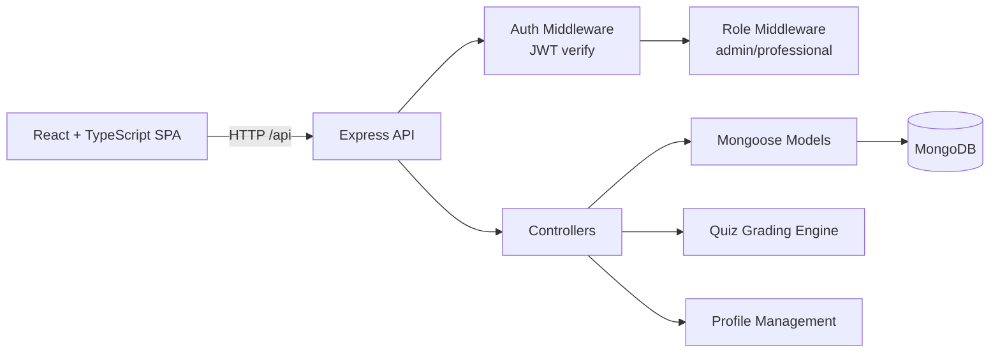
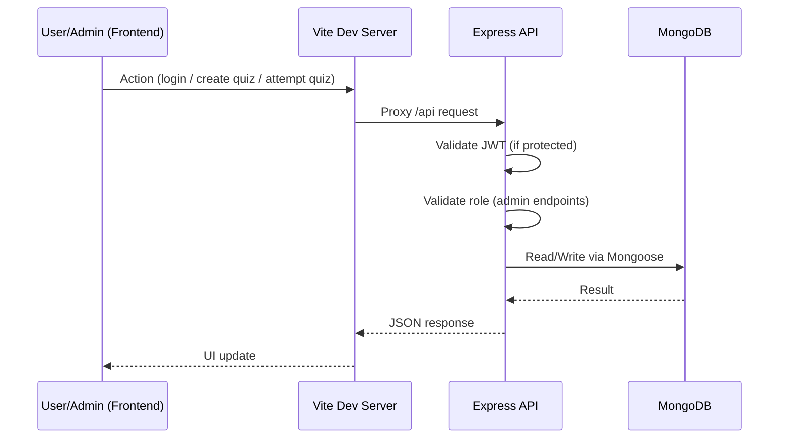
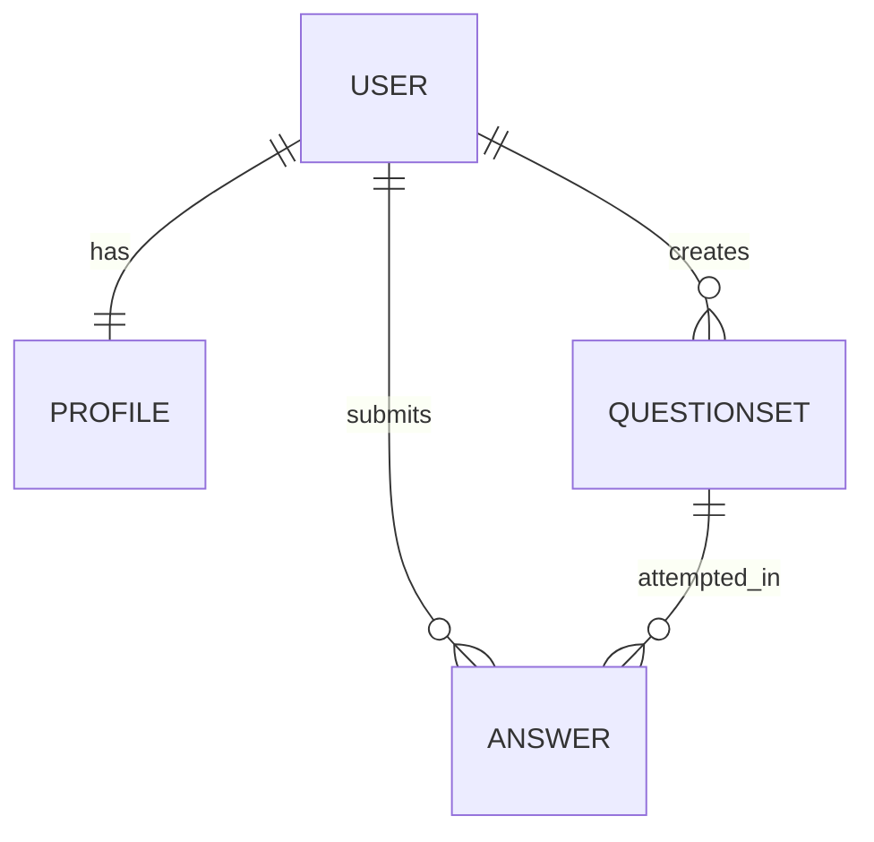

# BrainBuzz

BrainBuzz is a full-stack quiz platform where professionals can attempt role-curated quizzes and admins can create question sets through a protected workflow.

It demonstrates clean separation of concerns across frontend and backend layers, JWT-based security, role-aware authorization, and deterministic quiz grading.

## Technical Highlights

### Full-Stack Application Development

Built a complete quiz management platform using React, TypeScript, Node.js, Express, and MongoDB.

### Authentication & Authorization

Implemented JWT-based authentication, protected routes, and role-based access control for administrators and professionals.

### Quiz Lifecycle Management

Designed and implemented quiz authoring, listing, attempt submission, automated grading, and result persistence workflows.

### Database Design

Modeled application data using MongoDB and Mongoose with structured relationships between users, profiles, quizzes, and submissions.

### Secure API Development

Developed RESTful APIs with authentication middleware, authorization controls, request validation workflows, and protected business operations.

### Profile Management System

Implemented profile creation, profile updates, skill management, and user-centric data organization through dedicated profile models.

## Table of Contents

- Project Goals
- Core Features
- Tech Stack
- System Architecture
- Request Flow
- Folder Structure
- Database Design
- API Overview
- Local Setup
- Environment Variables
- Engineering Decisions
- Known Gaps and Next Improvements

## Project Goals

- Build an end-to-end quiz management system with separate admin and user capabilities.
- Practice secure authentication and authorization patterns in a REST API.
- Demonstrate scalable project organization for multi-feature full-stack apps.

## Core Features

### Authentication and Access Control

- User signup and login with hashed passwords (`bcrypt`).
- JWT access token issued at login (1-hour expiry).
- Token verification middleware for protected endpoints.
- Role-based middleware to restrict admin operations.

### Quiz Platform

- Admin creates full question sets with multi-choice support.
- Authenticated users can list available quiz sets.
- Users attempt quizzes and submit selected choices.
- Backend computes score and persists attempt records.

### Profile Management

- Auto-creates a profile document when a user is created.
- Supports "my profile" view and profile update endpoints.
- Skills are normalized to structured objects in DB.

## Tech Stack

### Frontend

- React 19
- TypeScript
- Vite
- React Router
- React Hook Form
- Axios + Fetch API utility

### Backend

- Node.js
- Express.js
- MongoDB
- Mongoose
- JSON Web Token (`jsonwebtoken`)
- `bcrypt`
- `multer`

## System Architecture



## Request Flow



## Folder Structure

```text
BrainBuzz/
|- backend/
|  |- app.js                      # Express app setup + middleware + routes + DB connect
|  |- bin/www                     # Server bootstrap + dotenv + port binding
|  |- controller/
|  |  |- adminController.js       # Admin quiz creation logic
|  |  |- indexController.js       # Auth verification endpoint handler
|  |  |- questionController.js    # Quiz list/fetch/attempt + scoring
|  |  |- userController.js        # Register/login/profile workflows
|  |- middleware/
|  |  |- AuthMiddleware.js        # JWT verification
|  |  |- RoleMiddleware.js        # Role checks
|  |  |- FileHandleMiddleware.js  # Multer config for profile uploads
|  |- model/
|  |  |- userModel.js
|  |  |- ProfileModel.js
|  |  |- QuestionSetModel.js
|  |  |- AnswerModel.js
|  |- routes/
|  |  |- index.js                 # root + auth verify route
|  |  |- userRoutes.js            # auth/profile/user routes
|  |  |- adminRoutes.js           # admin-only routes
|  |  |- questionRoutes.js        # quiz routes
|
|- frontend/
|  |- src/
|  |  |- App.tsx                  # Route gating by auth + role state
|  |  |- components/              # Reusable UI forms and widgets
|  |  |- pages/                   # Page-level route components
|  |  |- utils/api.ts             # Auth-aware API helper
|  |- vite.config.ts              # /api proxy to backend
```

## Database Design

MongoDB database name used by the app: `professor_database`.

### Collections and Relationships

- `users`: stores identity, credentials, and role.
- `profiles`: one-to-one with `users` by `user` ObjectId.
- `questionsets`: authored quizzes with nested questions and choices.
- `answers`: one attempt record per submission, linked to user and question set.



### Schema Summary

- `User`
    - `name`, `email (unique)`, `password (select:false)`, `role (admin|professional)`
- `Profile`
    - `user (unique ref User)`, `bio`, `profilePicture`, `skills[]`, `github`, `linkedin`, `portfolioUrl`
- `QuestionSet`
    - `title`, `questions[]`, `questions[].choices[]`, `createdBy (ref User)`
- `Answer`
    - `questionSet (ref QuestionSet)`, `user (ref User)`, `responses[]`, `score`, `total`, `submittedAt`

## API Overview

### Public Endpoints

- `POST /api/user/create` -> Register professional user
- `POST /api/user/create-admin` -> Register admin user
- `POST /api/user/login` -> Login and receive access token

### Protected Endpoints (JWT Required)

- `GET /api/verify/me` -> Token verification check
- `GET /api/user/list` -> List users
- `GET /api/user/profile/me` -> Fetch my profile
- `PUT /api/user/profile` -> Update my profile
- `GET /api/user/profile/:id` -> Fetch another user profile
- `GET /api/questions/set/list` -> List quiz sets with count
- `GET /api/questions/set/:id` -> Fetch one quiz set (without answer keys)
- `POST /api/questions/answer/attempt` -> Submit attempt and grade

### Protected + Admin-only Endpoints

- `POST /api/admin/questionset/create` -> Create question set

## Local Setup

### Prerequisites

- Node.js 18+
- npm 9+
- MongoDB (local or cloud instance)

### 1) Clone

```bash
git clone <your-repo-url>
cd BrainBuzz
```

### 2) Backend

```bash
cd backend
npm install
```

Create `.env` in `backend/`:

```env
PORT=3000
MONGO_URI=mongodb://localhost:27017
AUTH_SECRET_KEY=replace_with_a_long_random_secret
```

Run backend:

```bash
npm start
```

### 3) Frontend

Open a new terminal:

```bash
cd frontend
npm install
npm run dev
```

Frontend runs on Vite dev server and proxies `/api` to `http://localhost:3000`.

## Environment Variables

| Variable | Required | Description |
| --- | --- | --- |
| `PORT` | Yes | Express server port (default used in bootstrap: 3000) |
| `MONGO_URI` | Yes | MongoDB connection URI |
| `AUTH_SECRET_KEY` | Yes | Secret for signing/verifying JWT tokens |

## Engineering Decisions

- **Separated concerns by layer**: routes -> middleware -> controllers -> models.
- **JWT in Authorization header**: stateless auth simplifies API scaling.
- **Role middleware**: keeps authorization reusable and explicit.
- **Hidden answers in quiz fetch**: `correctAnswer` is excluded before sending quiz to clients.
- **Attempt persistence**: scores and submitted responses are stored for auditability.
- **Vite proxy**: frontend uses relative `/api` paths for cleaner local development.

## Known Gaps and Next Improvements

- Add refresh token flow and token revocation strategy.
- Add request validation layer (for example, Zod/Joi) for stronger input guarantees.
- Add test coverage (unit + integration + API contract tests).
- Improve rate limiting and abuse protection for auth endpoints.
- Fix minor payload naming mismatch in attempt flow (`selectedChoicesIds` vs backend expected key) for consistent scoring reliability.

## Technical Summary

BrainBuzz demonstrates full-stack application development using modern JavaScript technologies, secure authentication and authorization patterns, REST API design, database modeling, automated quiz grading workflows, and role-based user experiences.

The project highlights practical implementation of software engineering principles including separation of concerns, middleware-based security, reusable component architecture, and scalable project organization.
